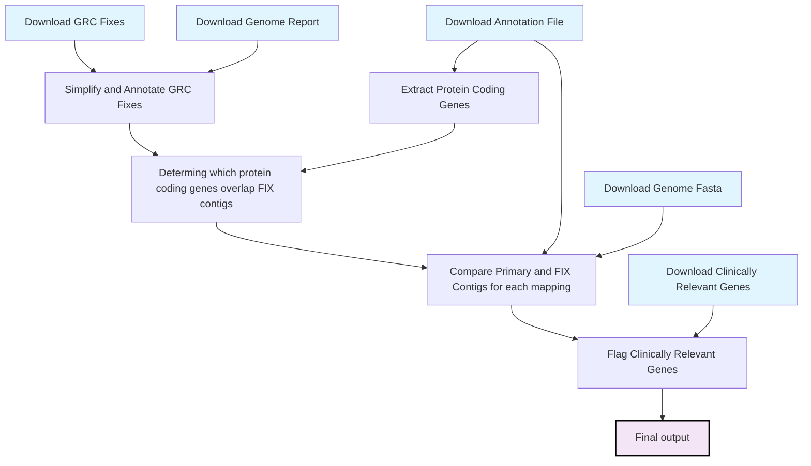

# RNACloud genome reference

## Workflows

### Gene Primary VS FIX contig comparison

#### Logic

#### Output

https://github.com/frontier-genomics/rnacloud_genome_reference/releases

#### Schema

[Output schema](docs/gene_primary_fix_comparison_summary.md)

## Notes

- NT_187633.1 / chr22_KI270879v1_alt (GSTT1)