# RNACloud genome reference

# Workflow

```mermaid
flowchart TB
    subgraph " "
    v0["Channel.from"]
    v2["Channel.from"]
    v4["Channel.from"]
    v6["Channel.from"]
    v8["Channel.from"]
    v10["Channel.from"]
    v12["Channel.from"]
    v21["gnomad_freq"]
    v22["gnomad_freq_threshold"]
    v23["gnomad_hemizygote_count_threshold"]
    v24["gnomad_homozygote_count_threshold"]
    v34["final_output_prefix"]
    v37["pairs"]
    v39["additional_gtfs"]
    v43["final_output_prefix"]
    end
    subgraph "DOWNLOAD_GENOME_AND_REFERENCES [DOWNLOAD_GENOME_AND_REFERENCES]"
    v1(["DOWNLOAD_AND_INDEX_GENOME"])
    v3(["DOWNLOAD_AND_INDEX_GTF"])
    v5(["DOWNLOAD_ASSEMBLY_REPORT"])
    v7(["DOWNLOAD_GRC_FIXES"])
    v9(["DOWNLOAD_CLINICALLY_RELEVANT_GENES"])
    v11(["DOWNLOAD_CEN_PAR_MASK_REGIONS"])
    v13(["DOWNLOAD_EBV"])
    end
    v14(["EXTRACT_PROTEIN_CODING_GENES"])
    subgraph "GRC_FIXES_ASSESSMENT [GRC_FIXES_ASSESSMENT]"
    v15(["SIMPLIFY_AND_ANNOTATE_GRC_FIXES"])
    v16(["COMBINE_GRC_FIXES_AND_PROTEIN_CODING_GENES"])
    v17(["COMPARE_FEATURES"])
    v18(["FLAG_CLINICALLY_RELEVANT_GENES"])
    end
    subgraph "SPLICE_SITE_GNOMAD_FREQ [SPLICE_SITE_GNOMAD_FREQ]"
    v19(["GET_CLINICALLY_SIGNIFICANT_PROTEIN_CODING_GENES"])
    v20(["EXTRACT_SJ_POSITIONS_FROM_CLINICALLY_SIGNIFICANT_GENES"])
    v25(["OET_SPLICE_SITE_GNOMAD_FREQ"])
    end
    subgraph "BUILD_GENOME_REFERENCE [BUILD_GENOME_REFERENCE]"
    v26(["CONVERT_GENOME_ANNOT_REFSEQ_TO_UCSC"])
    v29(["GET_TARGET_CONTIGS"])
    v30(["SUBSET_FASTA"])
    v31(["ADD_EBV"])
    v32(["REDUNDANT_5S_MASK_REGIONS"])
    v33(["GRC_FIX_AND_ASSEMBLY_MASK_REGIONS"])
    v35(["MASK_FASTA"])
    end
    subgraph " "
    v27[" "]
    v28[" "]
    v47[" "]
    end
    subgraph "BUILD_ANNOTATION_REFERENCE [BUILD_ANNOTATION_REFERENCE]"
    v36(["DECOMPRESS_GTF"])
    v38(["REMOVE_SECTIONS"])
    v40(["APPEND_GTFS"])
    v41(["CONVERT_ANNOTATION_REFSEQ_TO_UCSC"])
    v42(["GET_TARGET_CONTIGS"])
    v44(["SUBSET_GTF"])
    end
    v46(["CALCULATE_MD5_SUMMARY"])
    v45(( ))
    v0 --> v1
    v1 --> v17
    v1 --> v26
    v2 --> v3
    v3 --> v14
    v3 --> v17
    v3 --> v20
    v3 --> v32
    v3 --> v33
    v3 --> v36
    v4 --> v5
    v5 --> v15
    v5 --> v19
    v5 --> v26
    v5 --> v29
    v5 --> v41
    v5 --> v42
    v6 --> v7
    v7 --> v15
    v8 --> v9
    v9 --> v18
    v9 --> v19
    v10 --> v11
    v11 --> v33
    v12 --> v13
    v13 --> v31
    v14 --> v16
    v14 --> v19
    v15 --> v16
    v16 --> v17
    v17 --> v18
    v18 --> v29
    v18 --> v33
    v18 --> v42
    v18 --> v45
    v19 --> v20
    v20 --> v25
    v21 --> v25
    v22 --> v25
    v23 --> v25
    v24 --> v25
    v25 --> v45
    v26 --> v30
    v26 --> v28
    v26 --> v27
    v29 --> v30
    v30 --> v31
    v31 --> v35
    v32 --> v35
    v33 --> v35
    v34 --> v35
    v35 --> v45
    v36 --> v38
    v37 --> v38
    v38 --> v40
    v39 --> v40
    v40 --> v41
    v41 --> v44
    v42 --> v44
    v43 --> v44
    v44 --> v45
    v45 --> v46
    v46 --> v47
```

# Releases

https://github.com/frontier-genomics/rnacloud_genome_reference/releases

# Schema

- [GRC fixes assessment](docs/grc_fixes_assessment.md)
- [Essential splice sites gnomAD frequency](docs/splice_site_pop_freq.md)
