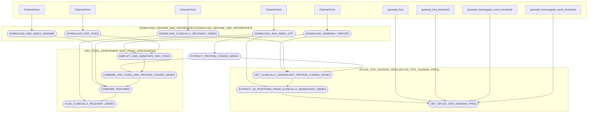

# RNACloud genome reference

# Workflow

```mermaid
flowchart TB
    subgraph " "
    v0["Channel.from"]
    v3["Channel.from"]
    v5["Channel.from"]
    v7["Channel.from"]
    v9["Channel.from"]
    v19["gnomad_freq"]
    v20["gnomad_freq_threshold"]
    v21["gnomad_hemizygote_count_threshold"]
    v22["gnomad_homozygote_count_threshold"]
    end
    subgraph "DOWNLOAD_GENOME_AND_REFERENCES [DOWNLOAD_GENOME_AND_REFERENCES]"
    v1(["DOWNLOAD_AND_INDEX_GENOME"])
    v4(["DOWNLOAD_AND_INDEX_GTF"])
    v6(["DOWNLOAD_ASSEMBLY_REPORT"])
    v8(["DOWNLOAD_GRC_FIXES"])
    v10(["DOWNLOAD_CLINICALLY_RELEVANT_GENES"])
    end
    v11(["EXTRACT_PROTEIN_CODING_GENES"])
    subgraph "GRC_FIXES_ASSESSMENT [GRC_FIXES_ASSESSMENT]"
    v12(["SIMPLIFY_AND_ANNOTATE_GRC_FIXES"])
    v13(["COMBINE_GRC_FIXES_AND_PROTEIN_CODING_GENES"])
    v14(["COMPARE_FEATURES"])
    v15(["FLAG_CLINICALLY_RELEVANT_GENES"])
    end
    subgraph "SPLICE_SITE_GNOMAD_FREQ [SPLICE_SITE_GNOMAD_FREQ]"
    v17(["GET_CLINICALLY_SIGNIFICANT_PROTEIN_CODING_GENES"])
    v18(["EXTRACT_SJ_POSITIONS_FROM_CLINICALLY_SIGNIFICANT_GENES"])
    v23(["OET_SPLICE_SITE_GNOMAD_FREQ"])
    end
    v0 --> v1
    v1 --> v14
    v3 --> v4
    v4 --> v11
    v4 --> v14
    v4 --> v18
    v5 --> v6
    v6 --> v12
    v6 --> v17
    v7 --> v8
    v8 --> v12
    v9 --> v10
    v10 --> v15
    v10 --> v17
    v11 --> v13
    v11 --> v17
    v12 --> v13
    v13 --> v14
    v14 --> v15
    v17 --> v18
    v18 --> v23
    v19 --> v23
    v20 --> v23
    v21 --> v23
    v22 --> v23
```
# Releases

https://github.com/frontier-genomics/rnacloud_genome_reference/releases

# Schema

[Output schema](docs/gene_primary_fix_comparison_summary.md)
