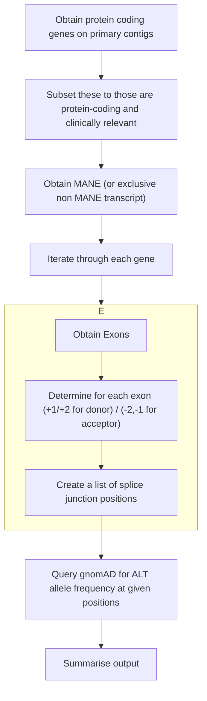

### gnomAD frequency for splice junctions

#### Logic

```mermaid
flowchart TD
  A[Obtain protein coding genes on primary contigs]
  A --> B[Subset these to those are protein-coding and clinically relevant]
  B --> C["Obtain MANE (or exclusive non MANE transcript)"]
  C --> D[Iterate through each gene]
  D --> E
  subgraph E
    F[Obtain Exons]
    F --> G["Determine for each exon (+1/+2 for donor) / (-2,-1 for acceptor)"]
    G --> H[Create a list of splice junction positions]
  end
  H --> I[Query gnomAD for ALT allele frequency at given positions]
  I --> J[Summarise output]
```